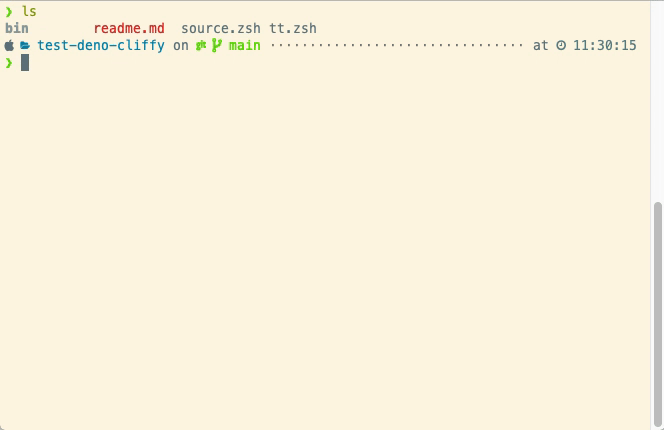

# Setup

```sh
# reload ohmyzsh, if you are not use ohmyzsh, just ignore this line.
omz reload

# generate completions for zsh
./bin/tt completions zsh > tt.zsh

# set `PATH` env and source tt.zsh
source ./source.zsh
```

# Reproduce

1. typing `tt deno `
2. then pressing `<tab>`

Now, we can see an error like this:

```sh
$ tt deno _arguments:463: command not found: script-script
tt
```

## Demo

